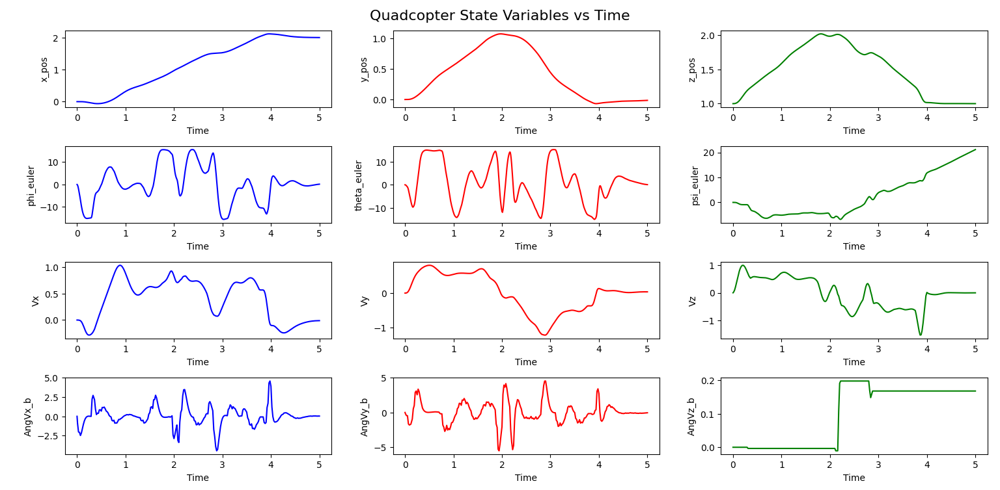
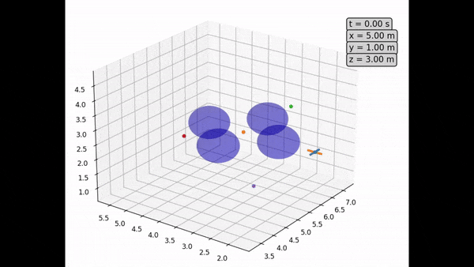

# 3D-Planning-and-Control

  

A drone flight simulation tool (currently based on quadcopters) for experimenting with algorithms in planning and control in different deployment scenarios. Updates in progress, watch this space.

## Description

This Python project allows users to simulate drone flight with provisions for choosing different control techniques and tweak simulation parameters in order to examine their effects. The intention is to provide a relatively lightweight tool which is designed to be modular and extensible. While it is still a work in progress in terms of simulation fidelity and structure, many features are already available to get started. 

  

## Getting Started

### Dependencies

Uses the following Python packages:

* **NumPy**
* **SciPy**
* **JAX**
* **CasADi**
* **Matplotlib**

### Installing
*	Recommended to set up a virtual environment with the required libraries and run the script inside the environment

### Executing program
*	Comment/uncomment lines in main.py to set desired planner, visualization etc. and simply execute the script. For tweaking other parameters, refer to the yaml files in the config folder.
*	Please refer to the documentation file (under development) for details regarding the project and theory behind the implementation

## Planned updates/To-dos
*	Add differential flatness feature to enable trajectory tracking for more aggressive paths
*	Add option for noisy estimates (and filtering techniques)
*	Direct Trajectory optimization such as Collocation
*	Improve PID autotuning
*	Port iLQR and CBF to new version of project
*	All the other “to-do”s in the code (sigh)

<!-- Currently doing some updates, so the other files can be ignored until the updates are done. This project provides Python code to simulate Quadrotor flight using different control techniques for different scenarios.

 

## Files

* **GH_quad_main:** Contains variables to choose a control technique, setup simulation scenarios & controller parameters and run the simulation. See comments for instructions on how to edit the file.
* **default_quad_params:** Contains values for properties related to the Quadrotor and simulation (Quadrotor mass, simulation timestep etc.)
* **GH_Quadcopter:** Module containing the *Quadcopter* class. Parameters and control techniques have been implemented as attributes and methods of this class respectively
* **Indirect_TrajOpt_Quat:** Module containing the *iLQR* class for trajectory optimization. 

## Available Options

### Simulation Scenarios:

Apart from varying parameters such as simulation time via *default_quad_params.py*, it is possible to enforce actuator limits and add obstacles to be avoided (rendered as a sphere). Actuator limits are added as a 'clipping factor', where the limit of each control input is set as weight of the quadrotor times this factor.

### Control Techniques:

The following control and planning techniques are currently available:

* **PID:** This is implemented as a Cascade loop for position and attitude control. The controller gains can be added manually or the *PID_AutoTune* method can be used to find the gains. However, depending on the quadrotor characteristics, the function may take a significant amount of time to execute as it is based on manual tuning heuristics. 

* **LQR:** LQR has been implemented based on modifications for quaternions mentioned in [[1]](#1).

* **MPC:** Convex MPC is available but may not actually reach intermediate points if specified at present
 
* **iLQR:** Trajectory generation for control constraints and obstacle avoidance has been implemented by wrapping the iLQR algorithm inside an Augmented Lagrangian method based on [[2,3]](#2)

A **CBF (Control Barrier Function)** setting for obstacle avoidance is also available which can switched on if desired when setting up the simulation.

## References

<a id="1">[1]</a>:  https://github.com/Optimal-Control-16-745

<a id="2">[2]</a>: https://bjack205.github.io/papers/AL_iLQR_Tutorial.pdf

<a id="3">[3]</a>: B. E. Jackson, K. Tracy and Z. Manchester, "Planning With Attitude," in IEEE Robotics and Automation Letters, vol. 6, no. 3, pp. 5658-5664, July 2021, doi: 10.1109/LRA.2021.3052431. 

## Planned updates/To-dos

* MPC updates (reason about obstacles, handle waypoints better)
* Add options for simulating with disturbances such as wind and noisy estimates (which will requires estimation techniques) 
* Direct Trajectory optimization such as Collocation
* Improve PID autotuning 
* Update requirements.txt -->